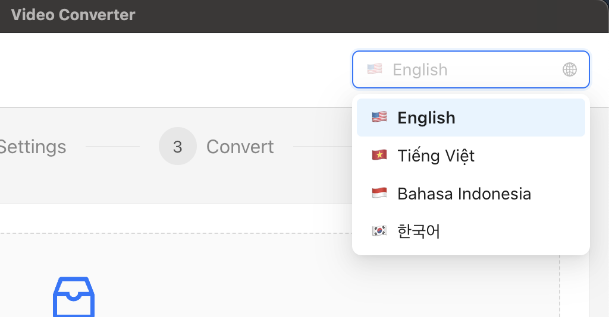

# SupaVideoConverter

🌐 **Bahasa Lain / Other Languages:**
- [English](README.md)
- [Tiếng Việt](README-vi.md)
- [한국어](README-kr.md)

---

Aplikasi desktop lintas platform untuk konversi format video yang dibangun dengan Electron, React, dan Ant Design, dikembangkan oleh Supa

## Fitur

- **Dukungan Multi-format**: Konversi MP4, AVI, MOV, MKV, WMV, FLV, WEBM, M4V, 3GP, OGV ke MP4
- **Opsi Kualitas**: Preset kualitas beragam (Rendah, Sedang, Tinggi, Lossless) dan pengaturan bitrate kustom
- **Penskalaan Resolusi**: Dukungan untuk 720p, 1080p, dan resolusi kustom
- **Pemrosesan Batch**: Konversi beberapa file sekaligus
- **Pelacakan Progress**: Progress konversi real-time dengan estimasi waktu tersisa
- **Drag & Drop**: Pemilihan file mudah dengan dukungan drag and drop
- **Lintas Platform**: Berfungsi di Windows dan macOS

## Screenshot

### Layar Selamat Datang

*Layar selamat datang yang menyambut pengguna saat meluncurkan aplikasi*

### Interface Utama

*Interface konversi utama menampilkan pemilihan file, pelacakan progress, dan kontrol konversi*

### Pemilihan Bahasa

*Opsi pemilihan bahasa untuk dukungan internasionalisasi*

### Pengaturan Video

*Pengaturan konversi video detail termasuk kualitas, resolusi, dan opsi output*

## Tech Stack

- **Electron** ^28.0.0 - Framework aplikasi desktop
- **React** ^18.2.0 - Framework UI frontend
- **Ant Design** ^5.12.0 - Pustaka komponen UI
- **Vite** ^5.0.0 - Tool build
- **FFmpeg** - Engine pemrosesan video
- **fluent-ffmpeg** ^2.1.2 - Wrapper Node.js untuk FFmpeg

## Instalasi

1. Clone repository:
```bash
git clone <repository-url>
cd video-converter-app
```

2. Install dependencies:
```bash
npm install
```

## Development

Untuk menjalankan aplikasi dalam mode development:

```bash
npm run electron:dev
```

Ini akan:
1. Memulai Vite dev server di http://localhost:5173
2. Meluncurkan aplikasi Electron secara otomatis
3. Mengaktifkan hot module replacement untuk komponen React

## Building

Untuk build aplikasi React:
```bash
npm run build
```

Untuk mengemas aplikasi Electron untuk distribusi:
```bash
npm run electron:dist
```

Ini akan membuat distributable di folder `dist`:
- **Windows**: Installer `.exe`
- **macOS**: Paket `.dmg`

## Scripts

- `npm run dev` - Hanya memulai Vite dev server
- `npm run build` - Build aplikasi React untuk production
- `npm run preview` - Preview production build
- `npm run electron` - Menjalankan Electron dengan file yang sudah di-build
- `npm run electron:dev` - Menjalankan dalam mode development
- `npm run electron:pack` - Package tanpa building
- `npm run electron:dist` - Build dan package untuk distribusi

## Struktur Proyek

```
video-converter-app/
├── src/                           # Source aplikasi React
│   ├── components/                # Komponen React
│   │   ├── FileInput/            # Komponen pemilihan file
│   │   ├── ConversionSettings/   # Konfigurasi pengaturan
│   │   ├── ProgressTracking/     # Tampilan progress
│   │   └── OutputManagement/     # Hasil dan output
│   ├── hooks/                    # Custom React hooks
│   ├── utils/                    # Utility functions
│   ├── styles/                   # Global styles
│   └── App.jsx                   # Aplikasi utama
├── electron/                     # Proses utama Electron
│   ├── main.js                   # Entry proses utama
│   ├── preload.js               # Script preload
│   └── services/                # Backend services
│       ├── VideoProcessor.js    # Wrapper FFmpeg
│       ├── FileManager.js       # Operasi file
│       └── SettingsManager.js   # Persistensi pengaturan
├── build/                       # Konfigurasi build
├── resources/                   # Resource statis
└── package.json                 # Konfigurasi proyek
```

## Cara Penggunaan

1. **Pilih File**: Drag and drop file video atau gunakan file browser
2. **Konfigurasi Pengaturan**: Pilih resolusi output, kualitas, dan folder tujuan
3. **Mulai Konversi**: Mulai proses konversi
4. **Lacak Progress**: Monitor progress real-time untuk setiap file
5. **Akses Hasil**: Buka folder output atau putar file yang sudah dikonversi

## Format yang Didukung

**Format Input:**
- MP4, AVI, MOV, MKV, WMV, FLV, WEBM, M4V, 3GP, OGV

**Format Output:**
- MP4 (H.264/AAC)

## Pengaturan Kualitas

- **Rendah**: 1 Mbps - File lebih kecil, kualitas lebih rendah
- **Sedang**: 3 Mbps - Kualitas dan ukuran seimbang
- **Tinggi**: 8 Mbps - Kualitas lebih tinggi, file lebih besar
- **Lossless**: 50 Mbps - Kualitas maksimum
- **Kustom**: Bitrate yang ditentukan pengguna (1-50 Mbps)

## Opsi Resolusi

- **Pertahankan Asli**: Mempertahankan resolusi sumber
- **720p**: 1280x720 (HD)
- **1080p**: 1920x1080 (Full HD)
- **Kustom**: Dimensi yang ditentukan pengguna

## Persyaratan

- **Node.js** 16+ (untuk development)
- **macOS** 10.15+ atau **Windows** 10+
- Setidaknya 4GB RAM untuk memproses file video besar
- Ruang disk yang tersedia untuk file output

## Troubleshooting

### Masalah Umum

1. **FFmpeg tidak ditemukan**: Aplikasi menyertakan binari FFmpeg, tetapi jika Anda mengalami masalah, pastikan aplikasi memiliki izin yang tepat.

2. **Pemrosesan file besar**: Untuk file di atas 4GB, pastikan Anda memiliki ruang disk dan RAM yang cukup.

3. **Konversi gagal**: Periksa bahwa file input tidak rusak dan direktori output memiliki izin tulis.

### Masalah Development

1. **Electron tidak mau mulai**: Pastikan semua dependencies diinstal dengan `npm install`

2. **Hot reload tidak bekerja**: Periksa bahwa Vite dev server berjalan di port 5173

3. **Build gagal**: Hapus node_modules dan install ulang dependencies

## Lisensi

MIT License - lihat file LICENSE untuk detailnya

## Berkontribusi

1. Fork repository
2. Buat feature branch
3. Buat perubahan Anda
4. Test secara menyeluruh
5. Submit pull request

## Dukungan

Untuk masalah dan permintaan fitur, silakan buat issue di repository.
