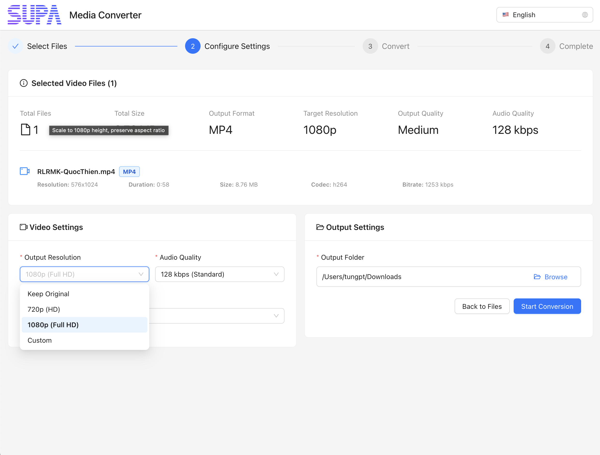

# SupaVideoConverter

🌐 **다른 언어 / Other Languages:**
- [English](README.md)
- [Tiếng Việt](README-vi.md)
- [Bahasa Indonesia](README-id.md)

---

Electron, React, Ant Design으로 구축된 비디오 형식 변환을 위한 크로스 플랫폼 데스크톱 애플리케이션, Supa에서 개발

## 기능

- **멀티 포맷 지원**: MP4, AVI, MOV, MKV, WMV, FLV, WEBM, M4V, 3GP, OGV를 MP4로 변환
- **품질 옵션**: 다양한 품질 프리셋 (낮음, 보통, 높음, 무손실) 및 사용자 정의 비트레이트 설정
- **해상도 스케일링**: 720p, 1080p 및 사용자 정의 해상도 지원
- **일괄 처리**: 여러 파일을 한 번에 변환
- **진행률 추적**: 예상 남은 시간과 함께 실시간 변환 진행률
- **드래그 앤 드롭**: 드래그 앤 드롭 지원으로 쉬운 파일 선택
- **크로스 플랫폼**: Windows 및 macOS에서 작동

## 스크린샷

### 환영 화면

*애플리케이션 실행 시 사용자를 맞이하는 환영 화면*

### 메인 인터페이스

*파일 선택, 진행률 추적 및 변환 컨트롤을 보여주는 메인 변환 인터페이스*

### 언어 선택

*국제화 지원을 위한 언어 선택 옵션*

### 비디오 설정

*품질, 해상도 및 출력 옵션을 포함한 상세한 비디오 변환 설정*

## 기술 스택

- **Electron** ^28.0.0 - 데스크톱 앱 프레임워크
- **React** ^18.2.0 - 프론트엔드 UI 프레임워크
- **Ant Design** ^5.12.0 - UI 컴포넌트 라이브러리
- **Vite** ^5.0.0 - 빌드 도구
- **FFmpeg** - 비디오 처리 엔진
- **fluent-ffmpeg** ^2.1.2 - FFmpeg용 Node.js 래퍼

## 설치

1. 저장소 복제:
```bash
git clone <repository-url>
cd video-converter-app
```

2. 의존성 설치:
```bash
npm install
```

## 개발

개발 모드에서 앱을 실행하려면:

```bash
npm run electron:dev
```

이것은 다음과 같은 작업을 수행합니다:
1. http://localhost:5173에서 Vite 개발 서버 시작
2. 자동으로 Electron 앱 실행
3. React 컴포넌트에 대한 핫 모듈 교체 활성화

## 빌드

React 앱을 빌드하려면:
```bash
npm run build
```

배포용 Electron 앱을 패키징하려면:
```bash
npm run electron:dist
```

이것은 `dist` 폴더에 배포 가능한 파일들을 생성합니다:
- **Windows**: `.exe` 설치 파일
- **macOS**: `.dmg` 패키지

## 스크립트

- `npm run dev` - Vite 개발 서버만 시작
- `npm run build` - 프로덕션용 React 앱 빌드
- `npm run preview` - 프로덕션 빌드 미리보기
- `npm run electron` - 빌드된 파일로 Electron 실행
- `npm run electron:dev` - 개발 모드에서 실행
- `npm run electron:pack` - 빌드 없이 패키징
- `npm run electron:dist` - 배포용 빌드 및 패키징

## 프로젝트 구조

```
video-converter-app/
├── src/                           # React 애플리케이션 소스
│   ├── components/                # React 컴포넌트
│   │   ├── FileInput/            # 파일 선택 컴포넌트
│   │   ├── ConversionSettings/   # 설정 구성
│   │   ├── ProgressTracking/     # 진행률 표시
│   │   └── OutputManagement/     # 결과 및 출력
│   ├── hooks/                    # 사용자 정의 React 훅
│   ├── utils/                    # 유틸리티 함수
│   ├── styles/                   # 전역 스타일
│   └── App.jsx                   # 메인 애플리케이션
├── electron/                     # Electron 메인 프로세스
│   ├── main.js                   # 메인 프로세스 진입점
│   ├── preload.js               # 프리로드 스크립트
│   └── services/                # 백엔드 서비스
│       ├── VideoProcessor.js    # FFmpeg 래퍼
│       ├── FileManager.js       # 파일 작업
│       └── SettingsManager.js   # 설정 지속성
├── build/                       # 빌드 구성
├── resources/                   # 정적 리소스
└── package.json                 # 프로젝트 구성
```

## 사용 방법

1. **파일 선택**: 비디오 파일을 드래그 앤 드롭하거나 파일 브라우저 사용
2. **설정 구성**: 출력 해상도, 품질 및 대상 폴더 선택
3. **변환 시작**: 변환 과정 시작
4. **진행률 추적**: 각 파일의 실시간 진행률 모니터링
5. **결과 액세스**: 출력 폴더 열기 또는 변환된 파일 재생

## 지원 형식

**입력 형식:**
- MP4, AVI, MOV, MKV, WMV, FLV, WEBM, M4V, 3GP, OGV

**출력 형식:**
- MP4 (H.264/AAC)

## 품질 설정

- **낮음**: 1 Mbps - 더 작은 파일, 더 낮은 품질
- **보통**: 3 Mbps - 균형 잡힌 품질과 크기
- **높음**: 8 Mbps - 더 높은 품질, 더 큰 파일
- **무손실**: 50 Mbps - 최대 품질
- **사용자 정의**: 사용자 정의 비트레이트 (1-50 Mbps)

## 해상도 옵션

- **원본 유지**: 소스 해상도 유지
- **720p**: 1280x720 (HD)
- **1080p**: 1920x1080 (Full HD)
- **사용자 정의**: 사용자 정의 치수

## 요구사항

- **Node.js** 16+ (개발용)
- **macOS** 10.15+ 또는 **Windows** 10+
- 대용량 비디오 파일 처리를 위한 최소 4GB RAM
- 출력 파일을 위한 사용 가능한 디스크 공간

## 문제 해결

### 일반적인 문제

1. **FFmpeg를 찾을 수 없음**: 앱에 FFmpeg 바이너리가 포함되어 있지만, 문제가 발생하면 앱에 적절한 권한이 있는지 확인하세요.

2. **대용량 파일 처리**: 4GB 이상의 파일의 경우 충분한 디스크 공간과 RAM이 있는지 확인하세요.

3. **변환 실패**: 입력 파일이 손상되지 않았고 출력 디렉토리에 쓰기 권한이 있는지 확인하세요.

### 개발 문제

1. **Electron이 시작되지 않음**: `npm install`로 모든 의존성이 설치되었는지 확인하세요

2. **핫 리로드가 작동하지 않음**: Vite 개발 서버가 포트 5173에서 실행 중인지 확인하세요

3. **빌드 실패**: node_modules를 지우고 의존성을 다시 설치하세요

## 라이선스

MIT License - 자세한 내용은 LICENSE 파일을 참조하세요

## 기여

1. 저장소 포크
2. 기능 브랜치 생성
3. 변경사항 적용
4. 철저히 테스트
5. 풀 리퀘스트 제출

## 지원

문제 및 기능 요청은 저장소에 이슈를 생성해 주세요.
