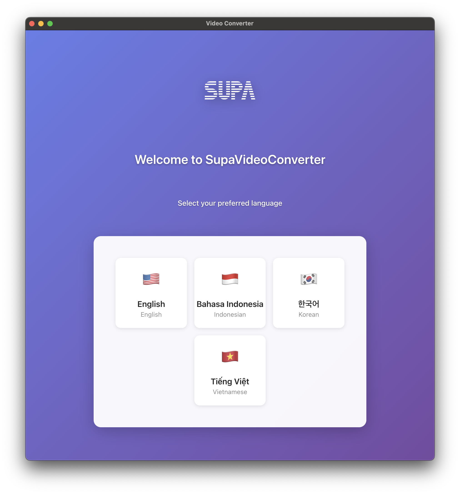

# SupaVideoConverter

🌐 **다른 언어 / Other Languages:**
- [English](README.md)
- [Tiếng Việt](README-vi.md)
- [Bahasa Indonesia](README-id.md)

---

몇 번의 클릭만으로 비디오를 MP4 형식으로 변환하는 간단하고 강력한 비디오 변환기입니다. Supa에서 개발했습니다.

## SupaVideoConverter란 무엇인가요?

SupaVideoConverter는 다양한 형식(MP4, AVI, MOV, MKV, WMV, FLV, WEBM, M4V, 3GP, OGV)의 비디오 파일을 고품질 MP4 비디오로 변환하는 데 도움이 되는 사용자 친화적인 데스크톱 애플리케이션입니다. 모든 기기와 플랫폼에서 비디오를 호환 가능하게 만드는 데 완벽합니다.

## 주요 기능

- **사용하기 쉬움**: 간단한 드래그 앤 드롭 인터페이스
- **멀티 포맷 지원**: 10개 이상의 비디오 형식에서 MP4로 변환
- **품질 제어**: 보통, 높음, 최고 품질 선택
- **해상도 옵션**: 원본 크기 유지 또는 720p, 1080p, 사용자 정의 해상도로 변환
- **일괄 처리**: 여러 비디오를 한 번에 변환
- **진행률 추적**: 실시간 변환 진행률 확인
- **다국어 지원**: 영어, 베트남어, 인도네시아어, 한국어로 제공

## SupaVideoConverter 사용 방법

비디오를 변환하기 위한 간단한 단계별 가이드를 따라하세요:

### 1단계: 첫 실행 및 언어 선택

**SupaVideoConverter에 오신 것을 환영합니다!** 앱을 처음 열면 이 환영 화면을 보게 됩니다.

**언어 선택:** 언어 선택기를 클릭하여 영어, 베트남어, 인도네시아어 또는 한국어 중에서 원하는 언어를 선택하세요.

### 2단계: 비디오 선택

**비디오 추가:** 메인 화면에서 다음을 할 수 있습니다:
- **드래그 앤 드롭**으로 비디오 파일을 앱에 직접 끌어다 놓기
- **"파일 추가"를 클릭**하여 컴퓨터에서 비디오를 찾아 선택하기
- **여러 비디오 추가**하여 모두 한 번에 변환하기

### 3단계: 비디오 설정 구성

**출력 사용자 정의:** 설정을 클릭하여 구성하세요:

**품질 옵션:**
- **보통** - 균형 잡힌 품질과 파일 크기 (대부분의 용도에 권장)
- **높음** - 더 나은 품질, 더 큰 파일 크기
- **최고** - 최대 품질, 가장 큰 파일 크기

**해상도 옵션:**
- **원본 유지** - 소스 비디오 해상도 유지
- **720p (HD)** - 표준 고화질 (1280x720)
- **1080p (Full HD)** - 풀 고화질 (1920x1080)
- **사용자 정의** - 자신만의 너비와 높이 설정

**출력 폴더:** 변환된 비디오를 저장할 위치를 선택하세요.

### 4단계: 변환 시작
비디오를 선택하고 설정을 구성한 후:
1. **"변환 시작"을 클릭**하여 프로세스 시작
2. **진행률 확인** - 진행률 표시줄과 예상 남은 시간을 볼 수 있습니다
3. **완료까지 대기** - 앱이 모든 비디오를 자동으로 처리합니다

### 5단계: 변환된 비디오 액세스
변환이 완료되면 다음을 할 수 있습니다:
- **출력 폴더 열기** - 클릭하여 변환된 모든 비디오 보기
- **비디오 재생** - 변환된 비디오를 클릭하여 즉시 재생
- **더 변환하기** - 새 비디오를 추가하고 프로세스 반복

## 지원 형식

**어떤 비디오를 변환할 수 있나요?**
- 입력: MP4, AVI, MOV, MKV, WMV, FLV, WEBM, M4V, 3GP, OGV
- 출력: MP4 (범용 호환)

## 최상의 결과를 위한 팁

- **소셜 미디어용**: 보통 품질과 1080p 해상도 사용
- **보관용**: 원본 해상도로 최고 품질 사용
- **공유용**: 품질과 파일 크기 균형을 위해 보통 품질 사용
- **모바일 기기용**: 더 빠른 처리를 위해 720p 해상도 사용

## 도움이 필요하신가요?

SupaVideoConverter 사용에 관해 문제가 발생하거나 질문이 있으시면, 저희 저장소에 이슈를 생성해 주시면 도와드리겠습니다!
