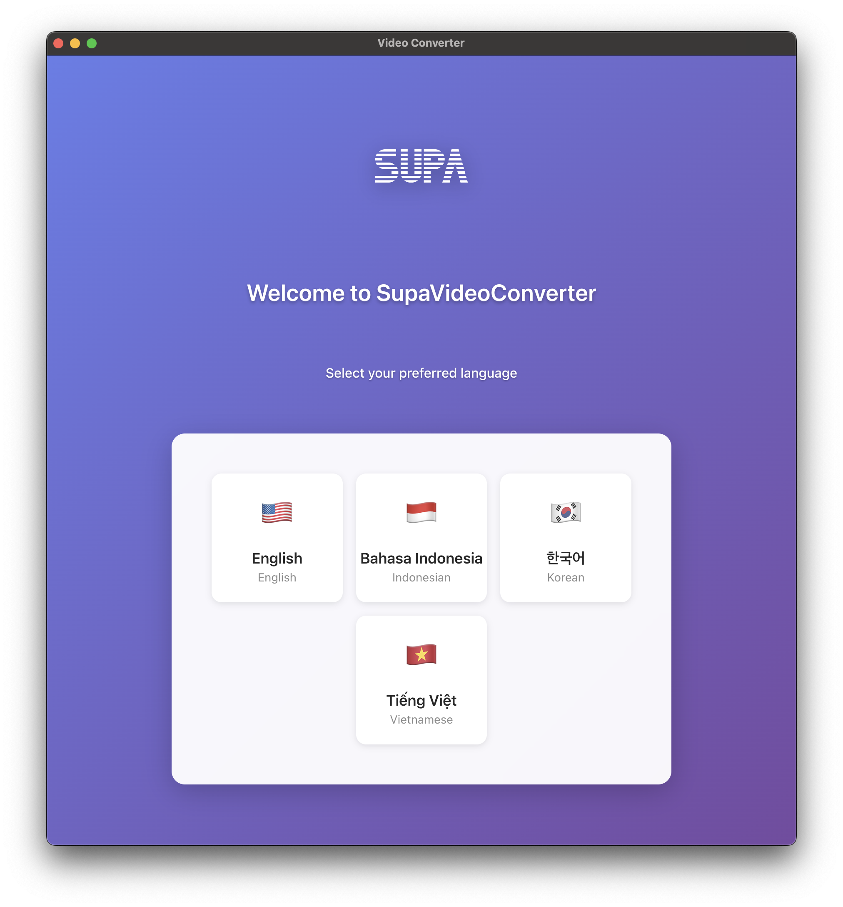
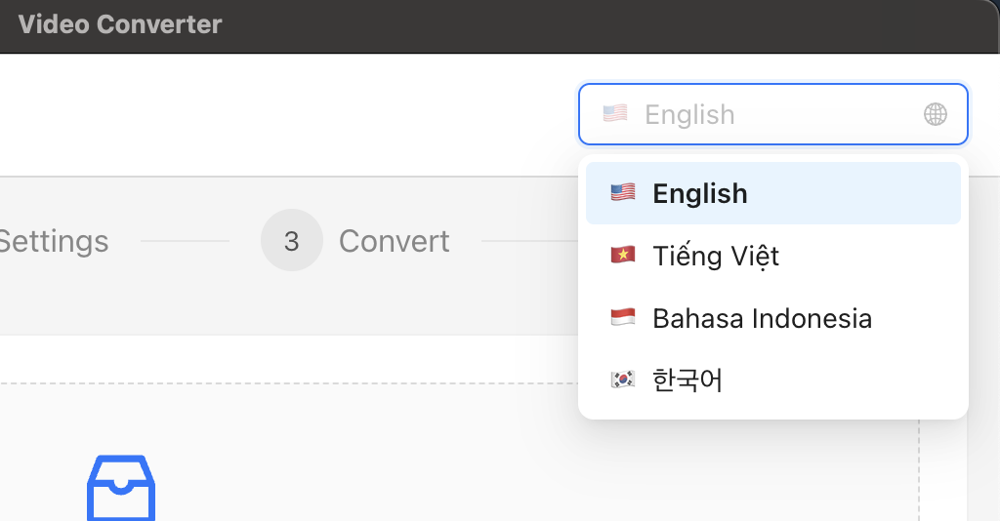
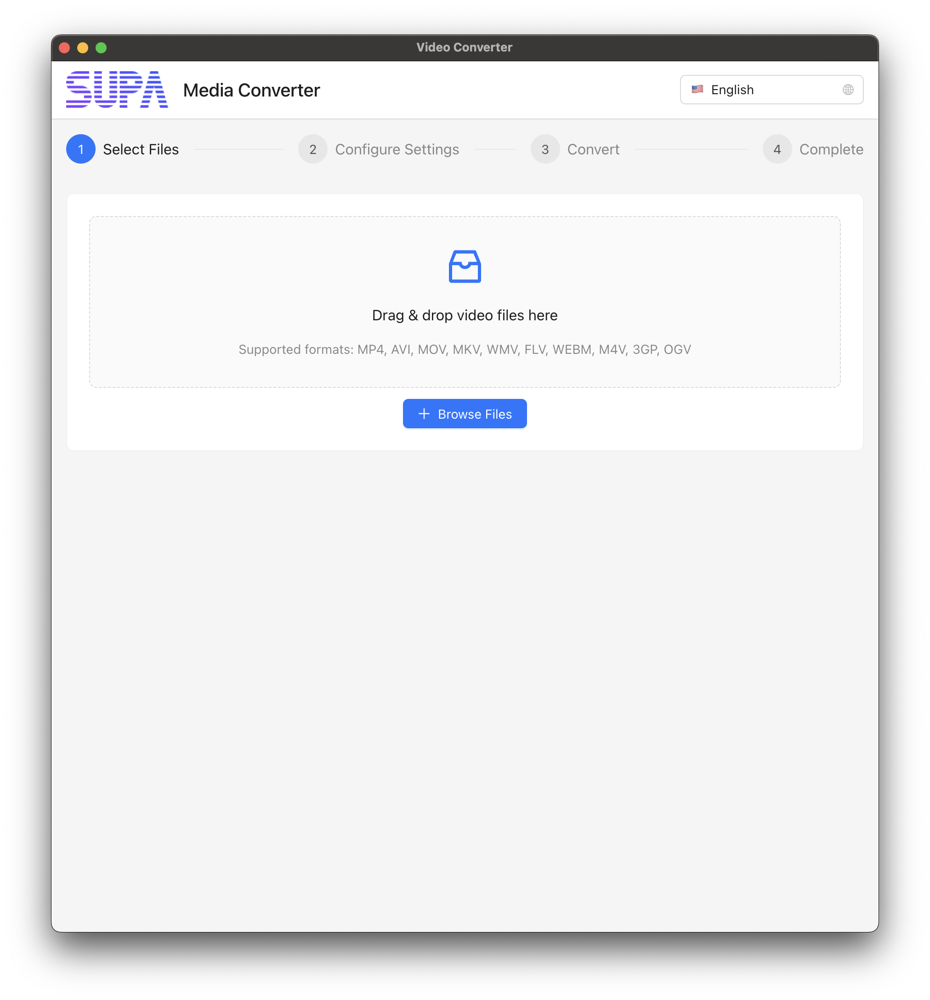
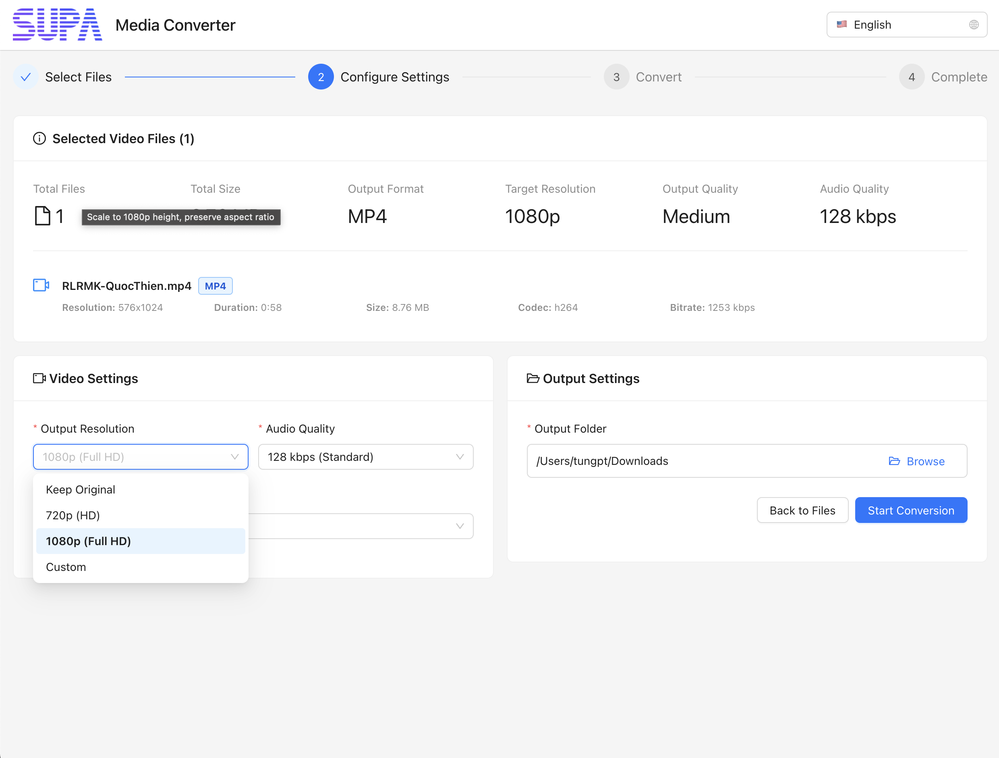

# SupaVideoConverter

🌐 **Ngôn ngữ khác / Other Languages:**
- [English](README.md)
- [Bahasa Indonesia](README-id.md)
- [한국어](README-kr.md)

---

Một ứng dụng chuyển đổi video đơn giản và mạnh mẽ giúp bạn chuyển đổi video sang định dạng MP4 chỉ với vài cú nhấp chuột. Được phát triển bởi Supa.

## SupaVideoConverter là gì?

SupaVideoConverter là một ứng dụng desktop thân thiện với người dùng giúp bạn chuyển đổi file video từ nhiều định dạng khác nhau (MP4, AVI, MOV, MKV, WMV, FLV, WEBM, M4V, 3GP, OGV) thành video MP4 chất lượng cao. Hoàn hảo để làm cho video của bạn tương thích trên tất cả thiết bị và nền tảng.

## Tính năng chính

- **Dễ sử dụng**: Giao diện kéo thả đơn giản
- **Hỗ trợ đa định dạng**: Chuyển đổi từ hơn 10 định dạng video sang MP4
- **Kiểm soát chất lượng**: Chọn từ Trung bình, Cao, hoặc Tốt nhất
- **Tùy chọn độ phân giải**: Giữ kích thước gốc hoặc chuyển sang 720p, 1080p, hoặc tùy chỉnh
- **Xử lý hàng loạt**: Chuyển đổi nhiều video cùng lúc
- **Theo dõi tiến trình**: Xem tiến trình chuyển đổi thời gian thực
- **Đa ngôn ngữ**: Có sẵn bằng tiếng Anh, Việt Nam, Indonesia và Hàn Quốc

## Cách sử dụng SupaVideoConverter

Làm theo hướng dẫn từng bước đơn giản này để chuyển đổi video của bạn:

### Bước 1: Khởi chạy lần đầu & Chọn ngôn ngữ

**Chào mừng đến với SupaVideoConverter!** Khi bạn mở ứng dụng lần đầu, bạn sẽ thấy màn hình chào mừng này.

**Chọn ngôn ngữ của bạn:** Nhấp vào bộ chọn ngôn ngữ để chọn ngôn ngữ ưa thích từ tiếng Anh, Việt Nam, Indonesia hoặc Hàn Quốc.

### Bước 2: Chọn video của bạn

**Thêm video:** Trên màn hình chính, bạn có thể:
- **Kéo thả** file video trực tiếp vào ứng dụng
- **Nhấp "Thêm file"** để duyệt và chọn video từ máy tính
- **Thêm nhiều video** để chuyển đổi tất cả cùng lúc

### Bước 3: Cấu hình cài đặt video

**Tùy chỉnh đầu ra:** Nhấp vào cài đặt để cấu hình:

**Tùy chọn chất lượng:**
- **Trung bình** - Cân bằng chất lượng và kích thước file (được khuyên dùng cho hầu hết trường hợp)
- **Cao** - Chất lượng tốt hơn, kích thước file lớn hơn
- **Tốt nhất** - Chất lượng tối đa, kích thước file lớn nhất

**Tùy chọn độ phân giải:**
- **Giữ nguyên** - Duy trì độ phân giải video gốc
- **720p (HD)** - Độ phân giải cao tiêu chuẩn (1280x720)
- **1080p (Full HD)** - Độ phân giải cao đầy đủ (1920x1080)
- **Tùy chỉnh** - Đặt chiều rộng và chiều cao của riêng bạn

**Thư mục đầu ra:** Chọn nơi bạn muốn lưu video đã chuyển đổi.

### Bước 4: Bắt đầu chuyển đổi
Sau khi bạn đã chọn video và cấu hình cài đặt:
1. **Nhấp "Bắt đầu chuyển đổi"** để bắt đầu quá trình
2. **Xem tiến trình** - Bạn sẽ thấy thanh tiến trình và thời gian còn lại dự kiến
3. **Chờ hoàn thành** - Ứng dụng sẽ xử lý tất cả video của bạn tự động

### Bước 5: Truy cập video đã chuyển đổi
Sau khi chuyển đổi hoàn tất, bạn có thể:
- **Mở thư mục đầu ra** - Nhấp để xem tất cả video đã chuyển đổi
- **Phát video** - Nhấp vào bất kỳ video đã chuyển đổi nào để phát ngay lập tức
- **Chuyển đổi thêm** - Thêm video mới và lặp lại quá trình

## Định dạng được hỗ trợ

**Video nào bạn có thể chuyển đổi?**
- Đầu vào: MP4, AVI, MOV, MKV, WMV, FLV, WEBM, M4V, 3GP, OGV
- Đầu ra: MP4 (tương thích toàn cầu)

## Mẹo để có kết quả tốt nhất

- **Cho mạng xã hội**: Sử dụng chất lượng Trung bình và độ phân giải 1080p
- **Cho lưu trữ**: Sử dụng chất lượng Tốt nhất với độ phân giải gốc
- **Cho chia sẻ**: Sử dụng chất lượng Trung bình để cân bằng chất lượng và kích thước file
- **Cho thiết bị di động**: Sử dụng độ phân giải 720p để xử lý nhanh hơn

## Cần trợ giúp?

Nếu bạn gặp bất kỳ vấn đề nào hoặc có câu hỏi về việc sử dụng SupaVideoConverter, vui lòng tạo issue trong repository của chúng tôi và chúng tôi sẽ giúp bạn!
